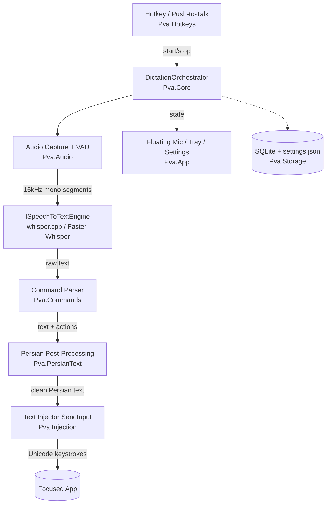

<div dir="rtl">

# معماری — Persian Voice Anywhere

این سند، طراحی سیستم است: اصول، pipeline اصلی، ماژول‌ها، مدل نخ‌ها (threading)،
ذخیره‌سازی، امنیت، بسته‌بندی و ریسک‌ها. هر تغییر ساختاری باید همین‌جا به‌روز شود.

## ۱. اصول راهبر

1. **هسته مستقل از UI.** منطق دیکته در `Pva.Core` زندگی می‌کند و هیچ نوع WPF
   نمی‌شناسد. UI فقط یک مصرف‌کننده است.
2. **درزها پشت اینترفیس.** موتور STT، ضبط صدا، تزریق متن، hotkey و storage همه
   پشت اینترفیس‌اند تا قابل‌تعویض و قابل‌تست باشند.
3. **مسیر داغ، غیرمسدودکننده.** ضبط و تشخیص روی نخ‌های پس‌زمینه؛ UI thread فقط رسم.
4. **Idle نزدیک صفر.** رویدادمحور، بدون polling؛ مدل فقط هنگام نیاز در حافظه.
5. **آفلاین تضمین‌شده.** هسته هیچ فراخوانی شبکه ندارد. شبکه فقط در قابلیت‌های
   opt-in و کاملاً جدا.
6. **پرتابل پیش‌فرض.** بدون نصب/رجیستری؛ داده و تنظیمات کنار exe.

## ۲. نمای کلان

</div>



<div dir="rtl">

## ۳. Pipeline دیکته (مسیر داغ)

۱. کاربر کلید میانبر را می‌زند (Push-to-Talk نگه‌داشته یا Toggle).
۲. `Pva.Audio` با WASAPI صدای ۱۶kHz مونو را ضبط می‌کند.
۳. VAD (Silero via ONNX) گفتار را از سکوت جدا و به قطعه‌ها می‌شکند.
۴. `ISpeechToTextEngine` هر قطعه را رونویسی می‌کند (GPU در صورت وجود، وگرنه CPU).
۵. `Pva.Commands` توکن‌های دستوری («خط بعد»، «ویرگول»…) را به کنش تبدیل می‌کند و از
   متن خارج می‌سازد.
۶. `Pva.PersianText` نرمال‌سازی و اصلاح فارسی را اعمال می‌کند (نیم‌فاصله، علائم،
   اعداد، ترکیب fa/en، اصطلاحات محافظت‌شده).
۷. `Pva.Injection` با `SendInput` (KEYEVENTF_UNICODE) متن را در اپ فوکوس‌دار تایپ
   می‌کند؛ کنش‌ها (Enter، Backspace، Undo) به‌صورت کلید ارسال می‌شوند.

**راهبرد تأخیر:** Whisper ذاتاً streaming نیست. در v1 مدل «ضبط تا مکث/توقف، سپس
رونویسی» است؛ برای دیکته‌ی طولانی، قطعه‌های VAD به‌صورت افزایشی رونویسی می‌شوند.
حالت‌ها (Idle / Listening / Processing) در میکروفون شناور نمایش داده می‌شوند.

## ۴. ماژول‌ها (پروژه‌های solution)

| پروژه            | مسئولیت                                                       | وابستگی‌ها |
|------------------|--------------------------------------------------------------|-----------|
| `Pva.Core`       | مدل‌های دامنه، اینترفیس‌ها، `DictationOrchestrator`           | —         |
| `Pva.Audio`      | ضبط WASAPI، `IAudioCapture`، VAD                             | Core      |
| `Pva.Stt`        | `ISpeechToTextEngine`، `WhisperCppEngine`، `FasterWhisperEngine`، انتخاب/fallback موتور | Core |
| `Pva.PersianText`| `IPersianTextProcessor` خالص و قطعی + دیکشنری‌ها             | Core      |
| `Pva.Commands`   | `ICommandParser`، گرامر دستور صوتی                           | Core      |
| `Pva.Injection`  | `ITextInjector` با SendInput                                 | Core      |
| `Pva.Hotkeys`    | `IHotkeyService`، low-level keyboard hook / RegisterHotKey   | Core      |
| `Pva.Storage`    | repositoryها (SQLite)، تنظیمات JSON، محافظت secret            | Core      |
| `Pva.Notepad`    | نوت‌پد تب‌دار (AvalonEdit)                                    | Core, UI  |
| `Pva.StickyNotes`| یادداشت چسبان                                                | Core, UI  |
| `Pva.Plugins`    | `IPlugin` SDK + host، نقاط توسعه                             | Core      |
| `Pva.App`        | میزبان WPF، composition root، tray، میکروفون شناور، تنظیمات   | همه       |
| `Pva.Tests`      | unit + integration + هارنس perf                             | همه       |

جهت وابستگی همیشه به‌سمت `Pva.Core` است؛ Core به هیچ‌کس وابسته نیست.

## ۵. اینترفیس‌های کلیدی (طرح اولیه)

</div>

```csharp
public interface ISpeechToTextEngine : IAsyncDisposable
{
    string Name { get; }
    bool SupportsGpu { get; }
    Task LoadAsync(ModelConfig config, CancellationToken ct);
    Task<SttResult> TranscribeAsync(AudioSegment audio, SttOptions options, CancellationToken ct);
    void Unload();
}

public interface IAudioCapture
{
    event EventHandler<AudioSegment> SegmentReady; // پس از VAD
    Task StartAsync(CancellationToken ct);
    Task StopAsync();
}

public interface IPersianTextProcessor            // خالص، بدون I/O
{
    string Process(string raw, PersianTextOptions options);
}

public interface ITextInjector
{
    Task TypeAsync(string text, CancellationToken ct);
    Task SendActionAsync(EditorAction action, CancellationToken ct); // Enter, Backspace, Undo…
}

public interface IHotkeyService
{
    event EventHandler<HotkeyEvent> Triggered;
    void Register(HotkeyBinding binding);
    void UnregisterAll();
}
```

<div dir="rtl">

## ۶. موتور STT هیبرید

طبق تصمیم مالک، هر دو موتور از روز اول پیاده می‌شوند، هر دو پشت
`ISpeechToTextEngine`:

- **WhisperCppEngine** (پیش‌فرض) — بر پایه‌ی `Whisper.net`؛ کاملاً native، بدون
  Python، داخل ZIP، پرتابل. GPU از طریق build‌های CUDA/Vulkan (بسته‌ی اختیاری).
- **FasterWhisperEngine** (اختیاری) — از طریق یک sidecar پایتون (Python embeddable
  + CTranslate2) با IPC ساده (JSON روی stdin/stdout یا سوکت محلی). دقت/سرعت CPU
  بهتر، اما حجیم‌تر.

**محافظت از پرتابل بودن:** بسته‌ی پایه فقط whisper.cpp دارد و همیشه کار می‌کند.
Faster Whisper یک «engine pack» اختیاری است که کاربر فعال/دانلود می‌کند. انتخاب
موتور در تنظیمات؛ اگر Faster Whisper در دسترس نبود، fallback خودکار به whisper.cpp.

**GPU:** بسته‌ی پایه CPU است؛ DLLهای GPU به‌عنوان بسته‌ی اختیاری (حجم بالا). تشخیص
در زمان اجرا و انتخاب بهترین backend.

## ۷. کیفیت فارسی (`Pva.PersianText`)

قوانین: نرمال‌سازی حروف عربی (`ي/ك` → `ی/ک`)، درج نیم‌فاصله (پیشوند می/نمی، جمع
«ها»، پسوند «تر/ترین»…)، اعداد فارسی (اختیاری)، علائم نگارشی، حفظ توکن‌های انگلیسی
و کد (`GitHub`, `Pull Request`) با فاصله‌گذاری درست، و دیکشنری اصلاح خطاهای رایج
گفتاری و اصطلاحات فنی محافظت‌شده. تشخیص با `initial_prompt` فارسی+فنی جهت‌دهی می‌شود.

این ماژول خالص و قطعی است و با تست‌های golden-file پوشش داده می‌شود. نمونه‌ی مرجع:
«امروز یک Pull Request روی GitHub زدم.»

## ۸. مدل نخ‌ها و کارایی

- **نخ ضبط** اختصاصی؛ رویداد `SegmentReady` به یک صف محدود (bounded channel) می‌رود.
- **worker STT** پس‌زمینه صف را مصرف می‌کند؛ هرگز UI را بلاک نمی‌کند.
- **UI thread** فقط رسم و به‌روزرسانی حالت (`System.Threading.Channels` +
  dispatcher برای هم‌گام‌سازی سبک).
- مدل به‌صورت lazy در اولین ضبط load و در صورت تنظیم در Idle unload می‌شود.
- اهداف کارایی: شروع < ۲ ثانیه، CPU در Idle < ۲٪، RAM پایه پایین. با
  BenchmarkDotNet و هارنس perf سنجیده و در CI محافظت می‌شوند.

## ۹. ذخیره‌سازی و امنیت

- **SQLite** (`Microsoft.Data.Sqlite`) برای تاریخچه، یادداشت‌ها، متادیتای ضبط.
- **تنظیمات JSON** کنار exe با schema نسخه‌دار و migration.
- **secretها:** DPAPI (`ProtectedData`) به‌صورت محلی؛ برای پرتابل بودنِ secret بین
  دستگاه‌ها، گزینه‌ی AES با رمز عبور کاربر. (DPAPI به کاربر/دستگاه گره خورده و بین
  ماشین‌ها منتقل نمی‌شود — این trade-off مستند است.)
- بدون telemetry. بدون شبکه در هسته. لاگ‌ها بدون صدا/متن کاربر در سطح Information.

## ۱۰. UI

WPF + WPF-UI (Fluent، Dark/Light، High-DPI). اجزا: System Tray
(Hardcodet.NotifyIcon.Wpf)، میکروفون شناور (پنجره‌ی بدون‌قاب، topmost، draggable،
شفافیت‌پذیر، مخفی‌شونده)، پنجره‌ی تنظیمات، نوت‌پد تب‌دار (AvalonEdit با جستجو/جایگزینی/
Word Wrap/RTL/Session Restore)، و Sticky Notes (پنجره‌های کوچک topmost و pin‌شونده).

## ۱۱. افزونه‌ها (`Pva.Plugins`)

SDK با `IPlugin` (متادیتا، چرخه‌ی حیات، نقاط مشارکت: دستورها، post-processorها،
providerهای بازنویسی). بارگذاری از پوشه‌ی `plugins/`. در v1 فقط اینترفیس‌ها و host
تعریف و سیم می‌شوند؛ marketplace کامل بعداً.

## ۱۲. بسته‌بندی و انتشار

- **ZIP پرتابل:** `dotnet publish -r win-x64 --self-contained -p:PublishSingleFile`
  → یک exe + DLLهای native whisper + `models/` + `settings.json`. بدون نصب/رجیستری.
- **EXE تک‌فایل** برای توزیع ساده.
- **MSIX** و **به‌روزرسانی خودکار** به‌عنوان قابلیت آنلاینِ opt-in، جدا از تضمین
  آفلاین هسته (بعد از v1).

## ۱۳. تست

xUnit (Assert خالص؛ در صورت نیاز Shouldly، مجوز MIT — نه FluentAssertions، ADR-0010).
Unit برای `PersianText` (golden)، `Commands`، `Storage`،
adapterهای موتور (mock). Integration برای pipeline کامل. Performance با
BenchmarkDotNet (شروع، Idle CPU، RAM). تست نشت حافظه با سنجه‌ها و سناریوهای طولانی.

## ۱۴. ثبت ریسک‌ها

| # | ریسک | کاهش |
|---|------|------|
| R1 | ناسازگاری Faster Whisper با پرتابل بودن (وابستگی Python) | بسته‌ی پایه فقط whisper.cpp؛ Faster Whisper به‌صورت engine pack اختیاری |
| R2 | کیفیت فارسی خام Whisper | ماژول پس‌پردازش اختصاصی + initial_prompt + تست golden |
| R3 | محدودیت SendInput در اپ‌های elevated (UIPI) و اپ‌های محافظت‌شده | مستندسازی، پیام شفاف، راهنمای اجرای elevated؛ Copy/Paste ممنوع است |
| R4 | پرچم‌خوردن hook/SendInput توسط آنتی‌ویروس | امضای کد (Code Signing)، کمینه‌کردن ردپای hook |
| R5 | تأخیر و UX دیکته‌ی طولانی | قطعه‌بندی VAD، نمایش شفاف حالت، گزینه‌ی warm نگه‌داشتن مدل |
| R6 | ابهام «دستور صوتی» در برابر «دیکته‌ی واقعی» یک واژه | حالت دستور / عبارات رزرو با toggle، قابل‌تنظیم |
| R7 | پرتابل بودن GPU (نیاز به درایور/CUDA) | CPU پایه؛ بسته‌ی GPU اختیاری؛ ترجیح Vulkan برای پرتابلی بیشتر |
| R8 | تضاد «بازنویسی AI» با «آفلاین محض» | v1 فقط اصلاح قاعده‌محور؛ بازنویسی AI بعداً، opt-in |
| R9 | حجم و توزیع مدل‌ها | مدل کوچک پایه یا دانلود در اولین اجرا؛ `models/` جدا از مخزن |
| R10 | مجوز کامپوننت‌ها برای استفاده‌ی تجاری | Whisper/whisper.cpp/CTranslate2/ONNX همه MIT/Apache؛ NOTICE پیش از انتشار |
| R11 | تضاد افکت‌های Liquid Glass با کارایی/پرتابلی | انیمیشن فقط هنگام فعال، احترام به reduced-motion، تنزل graceful بدون GPU، محدودکردن blur (ADR-0012) |

</div>
